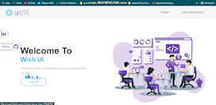

<div id="top"></div>
<!--
*** Thanks for checking out my Project. If you have a suggestion
*** that would make this better, please fork the repo and create a pull request
*** or simply open an issue with the tag "enhancement".
*** Don't forget to give the project a star!
*** Thanks again! Now go create something AMAZING! :D
-->


<!-- PROJECT SHIELDS -->

[![Issues][issues-shield]](https://github.com/Asuraking1n/wish-ui/pull/13)
[![LinkedIn][linkedin-shield]](https://www.linkedin.com/in/nishant-kumar-tiwari-253a46196/)


<!-- PROJECT LOGO -->
<br />
<div align="center">
  

 

  <h3 align="center">Wish UI: Component Library</h3>

  <p align="center">
    An awesome UI Component Library to jumpstart your projects!
    <br />
    <a href="https://wish-ui.netlify.app/html/docs.html"><strong>Explore the docs »</strong></a>
    <br />
    <br />
    <a href="https://wish-ui.netlify.app/">View Demo</a>
    ·
    <a href="https://github.com/Asuraking1n/wish-ui/issues">Report Bug</a>
    ·
    <a href="https://github.com/Asuraking1n/wish-ui/issues">Request Feature</a>
  </p>
</div>


<!-- TABLE OF CONTENTS -->
<details>
  <summary>Table of Contents</summary>
  <ol>
    <li><a href="https://wish-ui.netlify.app/html/docs.html#installation">Installation</a></li>
    <li><a href="https://wish-ui.netlify.app/html/docs.html#avatar">Avatar</a></li>
    <li><a href="https://wish-ui.netlify.app/html/docs.html#alert">Alert</a></li>
    <li><a href="https://wish-ui.netlify.app/html/docs.html#badge">Badge</a></li>
    <li><a href="https://wish-ui.netlify.app/html/docs.html#button">Buttons</a></li>
    <li><a href="https://wish-ui.netlify.app/html/docs.html#card">Card</a></li>
    <li><a href="https://wish-ui.netlify.app/html/docs.html#image">Images</a></li>
    <li><a href="https://wish-ui.netlify.app/html/docs.html#input">Input</a></li>
    <li><a href="https://wish-ui.netlify.app/html/docs.html#text">Text Utilities</a></li>
    <li><a href="https://wish-ui.netlify.app/html/docs.html#navigation">Navigations</a></li>
    <li><a href="https://wish-ui.netlify.app/html/docs.html#list">Lists</a></li>
    <li><a href="https://wish-ui.netlify.app/html/docs.html#modal">Modal</a></li>
    <li><a href="https://wish-ui.netlify.app/html/docs.html#snackbar">SnackBar</a></li>
    <li><a href="https://wish-ui.netlify.app/html/docs.html#rating">Rating</a></li>
  </ol>
</details>


<!-- ABOUT THE PROJECT -->
## About The Project


There are many great UI Libraries on GitHub; however, I didn't find one that really suited my needs so I created this enhanced one. I want to create a CL template so amazing that it'll be the last one you ever need -- I think this is it.

Here's why:
* Your time should be focused on creating something amazing. A project that solves a problem and helps others
* You shouldn't be doing the same tasks over and over like creating a components again and again
* You should implement DRY principles to the rest of your life :smile:

Of course, no one CL will serve all projects since your needs may be different. So I'll be adding more in the near future. You may also suggest changes by forking this repo and creating a pull request or opening an issue. Thanks to all the people have reviewed to expanding this CL!


### Built With


* [HTML](https://www.w3schools.com/html/)
* [CSS](https://www.w3schools.com/css/)
* [Vue.js](https://vuejs.org/)

<p align="right">(<a href="#top">back to top</a>)</p>


<!-- GETTING STARTED -->
## Installation

Well, This is the most easy part. Just copy, paste the code below and Wish will do all the hardwork for you.
Remember to paste Font Awesome CDN Link in your HTML file before using and use js cdn below before ending of body tag.
  ```sh
  <link rel="stylesheet" href="https://wish-ui.netlify.app/css/style.css">
  <script src="https://wish-ui.netlify.app/javascript/script.js"></script>
  ```

### Prerequisites

You don't need anything special, just wish a component and wish(UI) will grant your wish.


## Usage

Well, there are several uses for Wish UI- 

_For more examples, please refer to the [Documentation](https://wish-ui.netlify.app/html/docs.html)_

<p align="right">(<a href="#top">back to top</a>)</p>


<!-- ROADMAP -->

## Contributing

Contributions are what make the open source community such an amazing place to learn, inspire, and create. Any contributions you make are **greatly appreciated**.

If you have a suggestion that would make this better, please fork the repo and create a pull request. You can also simply open an issue with the tag "enhancement".
Don't forget to give the project a star! Thanks again!

1. Fork the Project
2. Create your Feature Branch (`git checkout -b feature/AmazingFeature`)
3. Commit your Changes (`git commit -m 'Add some AmazingFeature'`)
4. Push to the Branch (`git push origin feature/AmazingFeature`)
5. Open a Pull Request

<p align="right">(<a href="#top">back to top</a>)</p>


<!-- LICENSE -->


<!-- CONTACT -->
## Contact

Nishant Kumar Tiwari - [@my_Linkedin](https://www.linkedin.com/in/nishant-kumar-tiwari-253a46196/) - nishant88tiwari@gmail.com

Project Link: [Wish_UI](https://github.com/Asuraking1n/wish-ui/)

<p align="right">(<a href="#top">back to top</a>)</p>


<!-- MARKDOWN LINKS & IMAGES -->

[issues-shield]: https://img.shields.io/github/issues/othneildrew/Best-README-Template.svg?style=for-the-badge

[linkedin-shield]: https://img.shields.io/badge/-LinkedIn-black.svg?style=for-the-badge&logo=linkedin&colorB=555


